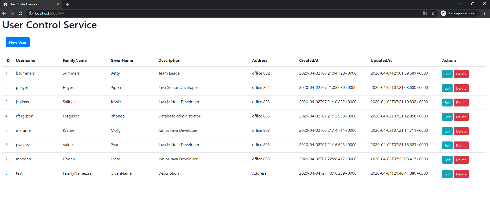

# User Control Service

- Sprint boot
    - Web
    - Data Jpa (Hibernate)
    - Security
- Vue.js as front    
- Docker to run database

#### Links
- Service video presentation on youtube https://youtu.be/ADu8bzpAqMI
- User Auth Control Cpi https://github.com/kuzminak/ex1-userauthcontrolapi
- SprintBoot Login via customAuthProvider example https://github.com/kuzminak/ex1-sprintbootlogin  

##### Configuration
- /src/main/resources/application.yml - service configuration

   `Change user-auth.crypt-password.salt for more security`
   
- /src/main/resources/import.sql - database init data

   

